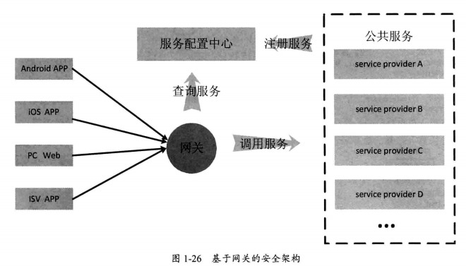
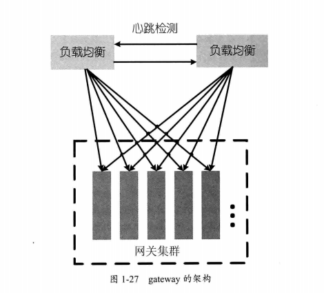

# HTTP服务网关
---
## 为什么需要Http服务网关
由于客户端App，第三方应用都必须通过公网来发起客户端请求，但是Http协议起包含的信息都是未经加密的明文，外界能够捕获并且模拟，安全性不高。

所以需要一个屏障来保障数据和接口的安全，于是就有了网关。

网关(gateway)接收外部各种App的Http请求，完成相应的权限和安全校验，
校验通过后，根据传入的服务名称，到服务配置中心找到相应的服务名称节点，并加载对应服务提供者的地址列表，这里会用到负载均衡算法，选择一个机器发起远程调用，将客户端参数传递到后端服务器。如下图：

* gateway能够较好地解决安全问题，对恶意请求或非授权的请求进行拦截和过滤。
* gateway能够通过服务名称进行路由和负载均衡调度，使得不同的平台之间能够很好地复用公共的业务逻辑，降低了开发和运维成本。

可想而知，对于外部App来说，都需要依赖gateway进行请求转发，所以gateway的流量是整个后端之和，因此gateway也需要集群化。

下图所示是一种网关集群的架构方案，有一组对等的服务器组成网关集群，网关集群前是两台负载均衡设备，负载均衡设备之间相互进行心跳检测，一旦一台宕机，另一台则改变自己的地址，接管宕机的设备的流量。

