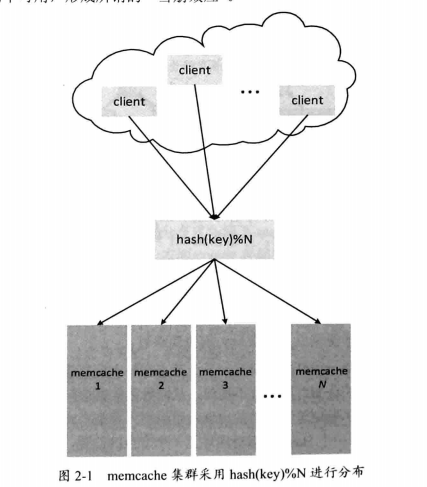
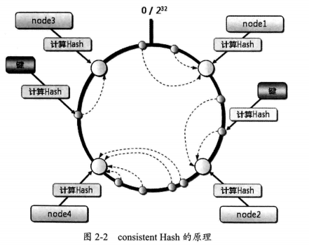
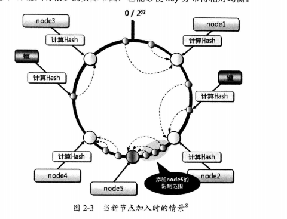

# memcache
---
* memcache是一款开源的高性能分布式内存对象缓存系统，用于在应用中减少对数据库的访问，提高应用的访问速度，并降低数据库的负载。为了在内存中提供数据的高速查找能力，memcache适应key-value形式存储和访问数据，在内存中维护一张巨大的Hashtable。如下图

* 当内存没有更多的空间来存储新的数据时，memcache就会使用LRU算法，将最近不常访问的数据淘汰掉。

* memcache存储支持的数据格式也是灵活的，通过对象的序列化机制，可以将更高层抽象的对象转换为二进制数据，存储在缓存服务器中，当需要时，又可以通过反序列化，将数据还原成原有对象。

* memcache本身本身不是一种分布式的缓存系统，它的分布式是由访问它的客户端来实现的。一种比较简单的方式是根据缓存的key来进行hash（hash（key）% N）。但是这样会有一个问题，一旦后端某台服务器宕机，或者集群压力过大，需要新增缓存服务器，这会使得大部分的key将会重新分布。这将是一场灾难。

## consistent hash算法介绍
它能够在移除/添加一台缓存服务器时，尽可能小地改变已经存在的key映射关系，避免大量key的重新映射。

原理：它将hash函数的值域空间组织成一个圆环，假设有4台服务器，分别为node1，node2，node3，node4，如下图。根据consistent hash算法，按照顺时针方向，分布在node1，node2之间的key值，被定位到node2，分布在node2，node4的key，被定位到node4。
假设有新节点node5增加进来。假设加在了node2和node4之间，那么受影响的只有之前分布在node2和node4之间的部分key，其他基本不受影响，这样大大减少了key的重新映射。为了避免node在环上分布不均，可以增加虚拟节点，虚拟节点内容指向实际节点。

